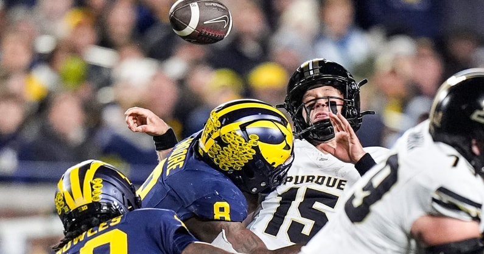

Why is no one streaming Hawai'i at a time like this?

###### Update: jk I found it

## Week 10 CFB Review 

I think I managed to find every single one of the most unwatchable games of the week. Real mind melting stuff. Luckily I caught the Mountain West nightcap in the 4th quarter. More below.

##### North Carolina 27 - 10 Syracuse

How many ACC wins will it take to extend the Belichick experiment at UNC?

##### Idaho 35 - 32 NAU (OT)

We watch FCS around here too

##### Texas 34 - 31 Vanderbilt

They're baaaack?

##### SMU 26 - 20 Miami (OT)

Miami, on the other hand, is not back.

##### West Virginia 45 - 35 Houston

Rich Rod Ranked Win!

woof

##### Duke 46 - 45 Clemson

Clemson still in play for the state title

##### New Mexico 40 - 35 UNLV

Extend Eck at all costs.

##### Minnesota 23 - 20 Michigan State (OT)

Boat rows over whatever is left of John Smith.

##### Arizona State 24 - 19 Iowa State

Don't take your college football team to Ireland.

##### Michigan 21 - 16 Purdue

Despite the image, I did not enjoy this game.  Bubble wrap during the bye week.

##### USC 21 - 17 Nebraska

Another Top 25 loss for the corn lovers

##### Arizona 52 - 17 Colorado

What?

##### Kentucky 10 - 3 Auburn

##### +

##### Oregon State 10 - 7 Washington State

Shitshow double feature of the week, watch both for the combined offensive action of one normally shitty game.

##### San Jose State 45 - 38 Hawai'i

Comeback comes up just short. Hawai'i had two hands on the onside kick
and you could just taste the bonus football. Shame.
