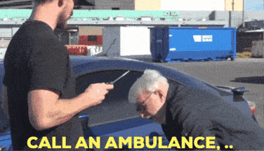

Leading story: IU is no longer the leading loser in college football

That title was handed [to a team in Michigan](https://www.espn.com/college-football/story/_/id/46944587/msu-hit-3-yr-probation-14-wins-3-seasons-vacated) by the NCAA earlier this week. 

The hammer finally came! Pretty sure I mentioned something about ineligible players [a couple weeks ago...](https://npoet.dev/blog/week7/)

There were also games this past weekend. See Below.

## Week 11 CFB Review

A lack of a Michigan game this week means I slept in. Nothing wrong with that when I have to wake up at 9 next Saturday to watch a [baseball game](https://www.mlb.com/cubs/tickets/events/football).

##### Houston 30 - 27 UCF

Much like that one movie where Clooney wasn't real, the *space game* ended in heartbreak for UCF.

##### Tulane 38 - 32 Memphis

This had playoff implications #shrinkthegame

##### Indiana 27 - 24 Penn State

Penn State fans were prepared to lose by 20 but this was way worse

##### West Virginia 29 - 22 Colorado

I want to leave Rich Rod off of here but actual FBS D-1A football teams keep losing to his bum ass in 2025

##### NDSU 15 - 10 North Dakota

These games occasionally have defense.

##### Oregon 18 - 16 Iowa

Even Oregon games occasionally have defense!

##### UCONN 37 - 34 Duke

There's always basketball season

##### Iowa State 20 - 17 TCU

Iowa State only plays one score games, and I don't like TCU. Recipe for selection right there

##### Vanderbilt 45 - 38 Auburn (OT)

Diego Pavia is also a 1 score game enthusiast. Not sure where Auburn came from though.

##### Wisconsin 13 - 10 Washington

Jedd may have been focused on the next job. There is no next job for Fickell.

##### North Carolina 20 - 15 Stanford

Another one for Bill?? 

##### Wake Forest 16 - 9 Virginia

Finally.

##### Cal 29 - 26 Louisville

This is why you count ranked wins from the time of the game. Check back with Louisville in 2 weeks.

##### Alabama 20 - 9 LSU

This game did not deserve the billing, nor the carrier dispute. 

*You guys are still paying for this shit??*

##### Nebraska 28 - 21 UCLA

YouTubeTV owes me $20 just for getting this game on a free live stream honestly

##### Sam Houston 21 - 17 Oregon State

Look how they massacred my PAC 2

##### Hawai'i 38 - 6 San Diego State

Put Hawai'i in the playoff immediately

