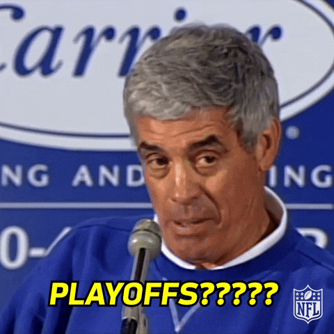

The midweek MACtion was great. If we could have skipped directly to the midday-Saturday slate I would've appreciated it.

Does Northwestern plan to play in a football stadium in the near future?

Will a single ACC team make the playoff?

Important questions will soon be answered.

## Week 12 CFB Review

I have witnessed enough turnovers for a lifetime.

##### Kent State 42 - 35 Akron (OT)

Just the perfect amount of defense for a Wednesday night.

##### Western Michigan 17 - 13 The University of Ohio

Western is rowing the boat

##### Clemson 20 - 19 Louisville

Please see last week's post about how you should have seen this coming

##### Texas A&M 31 - 30 South Carolina

This is why they play two halves, apparently. Absolute collapse from SC

##### Notre Dame 37 - 15 Pitt

Not 100! That's a win in someone's book. The ACC is down bad

##### Michigan 24 - 22 Northwestern

https://open.spotify.com/track/0aB0v4027ukVziUGwVGYpG?si=8f7d7582927d4420

##### Navy 41 - 38 USF

It is impossible to tell if this game somehow has playoff implications. Clearly this means the playoff is nebulously large.

##### Arizona 30 - 24 Cincinnatti

Arizona has a new all time leader in TD passes. Would like to know who it was before.

##### Kansas State 14 - 6 Oklahoma State

"Kansas State forces 5 turnovers to edge Oklahoma State" 

Whatever gets you going I guess.

##### UCONN 26 - 16 Air Force

##### LSU 23 - 22 Arkansas

Arkansas only plays painful games. Unlike Michigan they seem to lose them all at the moment.

##### Arizona State 25 - 23 West Virginia

Rich Rod win averted

##### Villanova 30 - 27 Stony Brook(??)

They play football?

##### Oklahoma 23 - 21 Alabama

When do we start talking about quality losses?

##### USC 26 - 21 Iowa

Iowa could only Iowa so far. Shame.

##### Penn State 28 - 10 Michigan State

*Land Grant Trophy alert*

Did they bench the guy that was totally taking them to the 'offs?

##### Weird Traitors 34 - 24 Florida

I try not to use phrases like "no-brainer" in matters involving the SEC, but this one really shouldn't be a choice for Lane.

##### UNLV 29 - 26 Utah State

Just ask Dan Lanning!

##### An Ohio State University 48 - 10 UCLA

Keep letting them win by 50. This is def not cope.

##### Georgia 35 - 10 Texas

They're not back. Does Sark have a Georgia problem?

##### Sac State 23 - 20 Idaho

Sometimes close is all you can ask for in a Pacific time late game.

##### San Diego State 17 - 7 Boise State

That was also the only thing keeping this miserable game on.