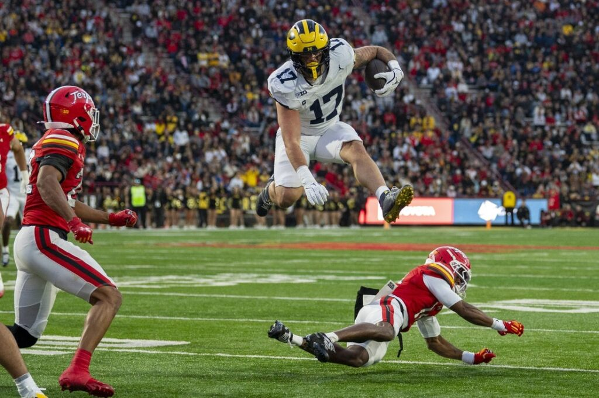
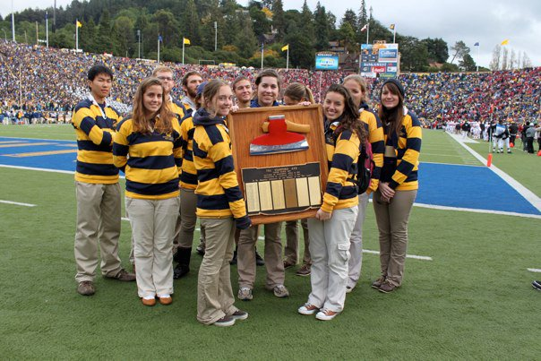

The SEC is still doing late season cupcake week in the year 2025. They are to blame for the lack of games in this review.

## Week 13 CFB Review

They are to blame with most of the things wrong with the sport, to be fair. Tony Petitti is responsible for the rest.

Scores from teams that played actual football this week (also LSU):

##### Akron 19 - 16 Bowling Green

Now that's MACtion

##### NC State 21 - 11 Florida State

Who even wants the FSU job at this point?

Time for Prime

##### Northwestern 38 - 35 Minnesota

Northwestern wins at Wrigley fr this time.

##### Yale 45 - 28 Harvard

Shocking result in the matchup known to exactly 15 living people as "The Game"

"Yale is going to the NCAA tournament!" *they dont even know what it's called*

##### James Madison 24 - 20 Washington State

Just like Ole Miss

##### Oregon 42 - 27 USC

The results are resulting so far. Go dawgs next week.

##### Iowa 20 - 17 Michigan State

MSU nearly won their first B1G conference game in how many years?

##### Duke 32 - 25 North Carolina

Fake punt downs semi-pro cheer bf Bill Belichick 

##### Utah 51 - 47 Kansas State

Utah delivering in true Big XII fashion. Not usually their bag.

##### Michigan 45 - 20 Maryland

Dr. Chip Lindsey

Or:

How I Learned To Stop Worrying And Love The Quick Screen

##### UCF 17 - 14 Oklahoma State

Oklahoma State has luckily already won a game this season.

##### Cal Poly 43 - 34 Eastern Washington

Losing streak ends for the ponies

##### Pitt 42 - 28 Georgia Tech

They told us the Notre Dame game didn't matter. GT needed to listen

##### Stanford 31 - 10 Cal

Do they do that trophy thing every year??

*they do*

##### LSU 13 - 10 Western Kentucky

Not what you're looking for when you schedule WKU, nor when you want to hire Lane Kiffin.
