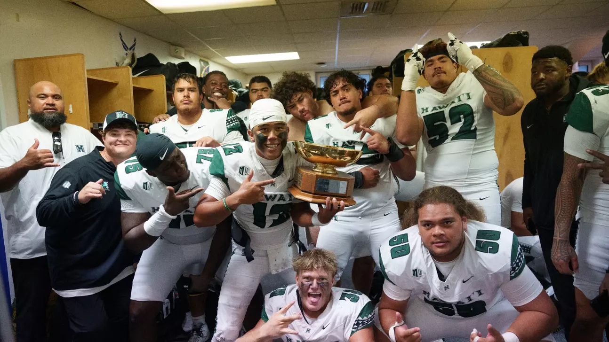

James Franklin has to be a plant. I'm not even sure how this one is his fault yet but good god. 

## Week 5 CFB Review

I don't feature schools in Charlottesville in these reviews but there was a field storming there Friday night, pleasantly devoid of pitchforks.

##### Arizona State 27 - 24 TCU

Another absolute thriller on Friday night. Best early week slate in recent memory

##### Georgia Tech 30 - 29 Wake Forest (OT)

Actual highway robbery

##### Illinois 34 - 32 USC

Right when you thought they were back

##### Cincinnati 37 - 34 Kansas

Thats a lot of points

##### Ohio State 24 - 6 Washington

Was this fun to watch? No. Was it a good game? Also no. 

##### Ole Miss 24 - 19 LSU

Did the over hit? 

Did Whit Weeks?

##### Indiana 20 - 15 Iowa

Indiana survives the weird Kinnick voodoo

##### Northwestern 17 - 10 UCLA

UCLA officially the worst team of all time

##### Hawai'i 44 - 35 Air Force

This is apparently a trophy game. Big win for the Rainbow Warriors

##### Tennessee 41 - 34 Mississippi State (OT)

Who beat Miss St? Karma or Tennessee?

##### Oregon 30 - 24 Penn State (2OT)

Dan Lanning thought this was over at 17-3. Turns out it was. I am looking for ways to blame this on James Franklin (obv) but frankly I can only see Allar's egregious chain. At least no one would ever snatch that.

##### Alabama 24 - 21 Georgia

Luckily for Kalen DeBoer's job security, Alabama somehow still owns Georgia. Someone look up DeBoer's record against former Saban assistants.

##### Stanford 30 - 29 San Jose State

Somehow this is a big win for Stanford. Not sure how we got here but can't really argue with it

##### Cal Poly 32 - 24 Sac State

Poly wins in battle of... *checks notes*... *FBS hopefuls????*

##### Mormons 24 - 21 Coach Prime

Lame tbh

It's looking increasingly likely that Oregon doesn't lose again until the postseason, if not until next year. Obviously the last Real National Championship in College Football was awarded in early 2024 (for the 2023 season) but at least an undefeated champ would have a right to celebrate.

###### Did it kill anyone to wait until Monday? Prob wont find out if it did i guess
