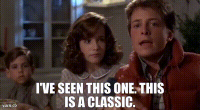

I'm sure ESPN will start the playoff grift soon, tune in at 6pm to find out which ~~2~~ ~~4~~ ~~12~~ 14(?) teams will be in this week.

## Week 8 CFB Review

Do they know all of these games are on sketchy YouTube channels? Did you? *You do now*

 ##### Louisville 24 - 21 Miami

I warned you all about this.

*Did you know Carson Beck is making more this year from his current team than Joe Flacco?*

##### Minnesota 24 - 6 Nebraska

Nebraska should really take a look at this row the boat guy, he's doing a great job in the Twin Cities

##### Vandy 31 - 24 LSU

The fighting Diego Pavia's get possibly their biggest ever home win and best start since 1950. Is the stadium done yet?

##### Michigan 24 - 7 Washington

After a nearly inexplicable halftime tie and a 3rd quarter that had my blood boiling, the Michigan linebacker room found the hands for the whole team. Big bounceback spot. Please stop dropping everything.

##### Tulane 24 - 17 Army

Insane final 2 minutes. Worth a highlight check

##### 1ndiana 38 - 13 Michigan State

John Smith is definitely next. Hate week starts with a whimper in East Lansing.

##### Georgia 43 - 35 Weird Traitors

Lane is taking the Florida job anyway. I'd say hire James Franklin but I'm certain they aren't ready for that yet (but their kids are gonna love it)

##### SMU 35 - 24 Clemson

Is Dabo next? Does Jesus get offended that this is apparently his likeness? Holy retribution on the way in northern SC (just not the way they think)

##### Arizona State 26 - 22 Texas Tech

Plenty of tortillas in Tempe, they just know they don't belong on the field.

##### UAB 31 - 24 Memphis

UAB literally stopped playing football a few years ago what is happening

##### Florida 23 - 21 Mississippi State

But you're fired anyway! Sorry Billy

##### Texas A&M 45 - 42 Arkansas

Another shootout from a top 5 SEC team, perhaps we should either reevaluate Arkansas or maybe admit some of these teams are not good

##### Oregon 56 - 10 Rutgers

So what is the goal if you're a Rutger in 2025? Genuinely curious

##### Virginia 22 - 20 Wazzu

A tiebreaking safety was the difference here.

##### Texas 16 - 13 Kentucky (OT)

Just an awful viewing experience from start to finish.

##### Iowa 25 - 24 Penn State

Can they fire Frames again?

##### Hawai'i 31 - 19 Colorado State

Bowl eligible Hawai'i is here. We told you to begin preparations last week but many mainlanders did not listen.

##### Notre Dame 34 - 24 USC

Throwing in the rain is hard, someone inform these two coaching staffs ASAP

##### Mormons 24 - 21 Utah

Holy War becoming more one-sided than your average crusade, what a shame

##### Stanford 20 - 13 Florida State

How Stanford can have drone shows but no pylon cams is beyond me. Pretty sure FSU scored the tying TD as time expired but the circa-1999 camera setup at the farm means we will never know for sure. Big win for the Tree

And last but certainly not least:

#### Manchester United 2 - 1 Liverpool

You can all walk home, alone, from Bryanfield at once. 4 straight losses? Bald Dutch manager? 

