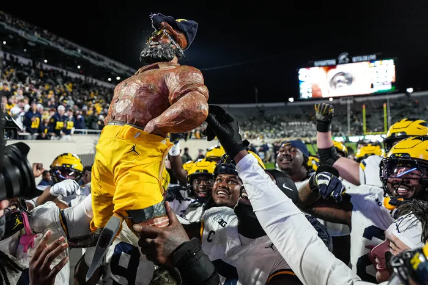

Hate week is at an end. Was another night game worth it for the East Lansing PD?

## Week 9 CFB Review 

So happy for sparty, finally getting their garbage time TD this year. They say great teams cover. [A season high for penalties too!](https://cityofeastlansing-police-dept-citizen-forms.app.transform.civicplus.com/forms/33107)

##### Western Kentucky 28 - 27 Louisiana Tech

Always go for 2.

##### Delaware 31 - 28 MTSU

My NCAA '07 (or was it madden?) create a team wore those same uniforms and I would like credit

##### Virginia Tech 42 - 34 Cal

Not sure why it took a whole 30 min for VT to discover no one wants to tackle them. 

##### 1ndiana 56 - 6 UCLA

It's time to tell your kids about undefeated Indiana. Better they find out from a responsible adult.

##### Oklahoma 26 - 34 Weird Traitors

Mateer isn't winning the Hesiman. It'll be someone with a much sillier name

##### North Carolina 16 - 17 Virginia

Still, always go for 2.

##### Memphis 34 - 31 USF

This has to have interesting circle-of-suck implications

##### Nebraska 28 - 21 Northwestern

For every Washington there's a Nebraska. You'll figure it out.

##### Vandy 17 - 10 Mizzou

This one was boring. Not much else to say.

##### Mormons 41 - 27 Iowa State

I looked away from this game for 5 minutes with ISU up 2 scores. I have no idea what happened from there

#####  Texas 45 - 38 Mississippi State (OT)

Didn't think this Texas team had that sort of comeback in them.

##### Alabama 29 - 22 South Carolina

South Carolina is going to struggle to see a bowl game this season. Slightly short of expectations, for some.

##### Washington 42 - 25 Illinois

Washington ranked! USC receiving votes...

##### Texas A&M 49 - 25 LSU

Likely the end for Brian Kelly at LSU. It couldn't have happened to a nicer guy. A real pillar of the community. Knew how to (scissor) lift guys up. What a shame 

##### Michigan 31 - 20 Michigan State

Trophy ownership alert: Paul stays home after a brief drive up to mid-Michigan. He went to get 18 in at Eagle Eye one last time before the snow shows up.

###### Update: I checked, and he did (31-13 loss, nearly identical). Not great.

Pretty sure the last John Smith at MSU got fired under these exact circumstances, so maybe they should've seen this coming. Someone check the 2006 wikipedia page for me

##### Tennessee 56 - 34 Kentucky

This should probably be a bigger rivalry for both teams, also 90(!) points??

##### Houston 24 - 16 Arizona State

"Future Big XII champs Houston"

Pretending that Colorado game didnt happen. Awful games should be illegal from the artists formerly known as the PAC ~~10~~ 12 After Dark. It's all we have out here on the West Coast post 8pm. We deserve better.
